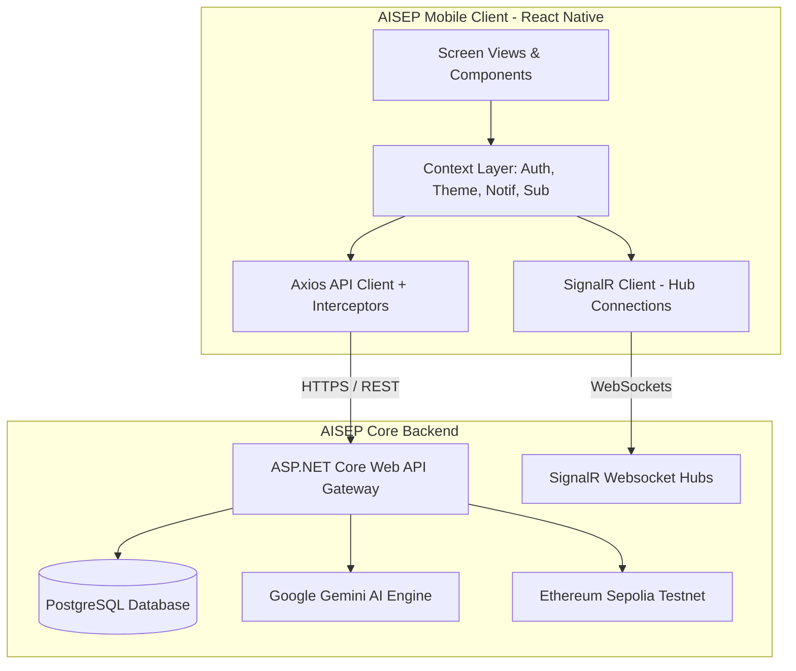
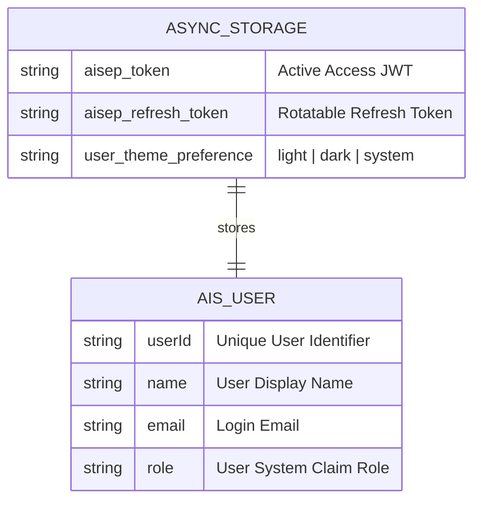
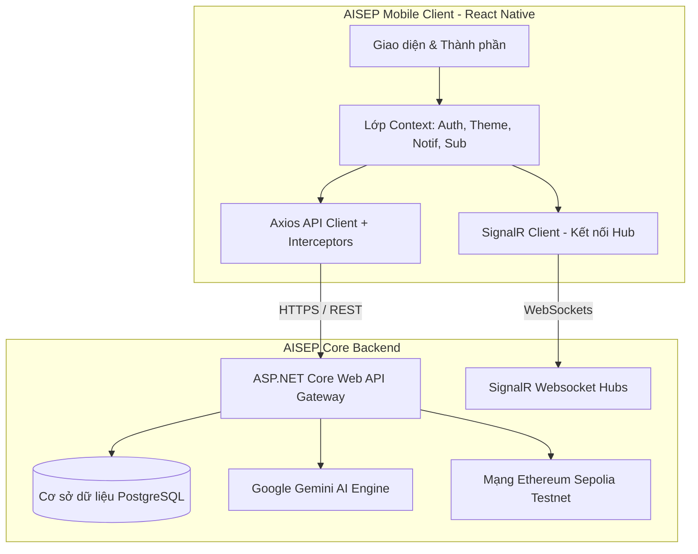

# AISEP_Mobile - AI-powered Startup Evaluation & Investment Platform (Mobile Application)

Welcome to the official repository of the **AISEP_Mobile** application, the client-side mobile experience of the AISEP platform. This document provides a complete technical, architectural, and operational reference for developers, recruiters, professors, and stakeholders.

---

# 🇺🇸 English Version

## 1. Project Title
# AISEP Mobile Application
> **High-Fidelity React Native (Expo) client designed to empower Startups in evaluating project metrics, securing Intellectual Property on-chain, and closing investment deals.**

[](https://expo.dev/)
[](https://reactnative.dev/)
[](LICENSE)
[](https://dotnet.microsoft.com/en-us/apps/aspnet/signalr)
[](https://ethereum.org/)

---

## 2. Project Overview
**AISEP (AI-driven Startup Evaluation Platform)** is an enterprise ecosystem that bridges the gap between early-stage startups, business advisors, and venture capitalist (VC) investors. 

While the AISEP Web App handles administrative and heavy data manipulation workflows for all stakeholders, the **AISEP_Mobile** application is custom-tailored **exclusively for Startup Founders** to provide a portable, secure, and interactive mobile portal. Through a minimalist Twitter/X-inspired interface, founders can:
*   Draft, upload, and update startup profiles and business models.
*   Request **Gemini AI Audits** to generate analytical scorecards directly from their phone.
*   Verify startup IP and sign venture contracts securely with **on-chain Ethereum (Sepolia) registration**.
*   Coordinate consultations with expert advisors, complete with booking calendar sync and custom SignalR real-time chats.
*   Securely review, approve, and verify VC investment deals.

---

## 3. Executive Summary
Early-stage fundraising suffers from information asymmetry, slow validation processes, and intellectual property theft risks. Startups struggle to prove their business legitimacy, while investors are overwhelmed by unvetted pitch decks. 

**AISEP_Mobile** solves these challenges by combining mobile accessibility with:
1.  **AI-Powered Standardized Audits:** Integrating Google Gemini to score and analyze startups across critical criteria (market size, team strength, product innovation), reducing VC due diligence duration from weeks to minutes.
2.  **Web3 Trust Layer:** Cryptographically hashing deal contracts and intellectual property documents on the Ethereum Sepolia Testnet, creating immutable, tamper-proof proof-of-existence.
3.  **Real-Time Collaborative Network:** Providing SignalR websocket connections for instantaneous communication, calendar-integrated consultations, and deal flow progression on the move.

Designed with Expo Router for seamless cross-platform performance and styled with a curated AMOLED-compatible dark mode, AISEP_Mobile delivers an enterprise-grade mobile experience matching the highest modern standard.

---

## 4. Key Features

### 🚀 Core Features Matrix
| Feature | Input / Parameters | Processing | Output / Result | Business Value |
| :--- | :--- | :--- | :--- | :--- |
| **Gemini AI Evaluation** | Project brief, Stage, Industry, UVP, Financial drafts. | Triggers `/api/StartupAIAnalysis/.../analyze`. Gemini checks criteria, issues weights, and calculates potential scores. | Audited Items list, strengths/weaknesses breakdown, adjustment scores, Gemini advice. | Delivers immediate, unbiased project assessment; highlights pitch weaknesses before VC review. |
| **Blockchain Verification** | Project metadata & uploaded documents. | Hashes documents locally/remotely and logs metadata to Ethereum Sepolia smart contract. | TxHash linkable to Sepolia Etherscan explorer, verification badge, block timestamp. | Guarantees intellectual property protection; provides immutable proof-of-exist. |
| **Deal Negotiation & Signing** | Investment Deal ID, Terms, Reject/Approve decisions. | Dual-phase verification. Calls `/api/Deals/.../verify` (Phase 2 confirmation) to execute on-chain minting. | Legally referenced digital contract, updated status badge, Etherscan tx record. | Speeds up capital closure; eliminates physical paperwork through legally-coded on-chain agreements. |
| **SignalR Chat & Notifications** | WebSocket text message input, push permissions. | SignalR Hub connects client to ChatHub/NotificationHub; handles local push alerts on background/foreground changes. | Real-time chat bubbles, live unread notification count badge, foreground popups. | Enhances stakeholder engagement; eliminates delayed responses during active deals. |
| **Dynamic Form Validation** | Form field text input (e.g. Stage, UVP, Email). | Downloads schema-based rules `/api/form-validation-rules/{formKey}` dynamically. Evaluates fields against custom unicode regex. | Real-time Vietnamese error messages, conditional field rendering (e.g. Stage-based fields). | Prevents database contamination; guides founders into inputting correct business metrics. |
| **Premium Subscriptions** | Sandbox Payment selection, voucher codes. | Calculates quota allowances (AI audits, project unlocks, advisor slots) via `/api/Subscription`. | Upgraded account status, active quota progress bars. | Generates platform revenue; gates compute-intensive AI endpoints. |

---

## 5. User Roles & Restrictive Gating

AISEP_Mobile enforces **strict Startup-only client-side role validation** to restrict system access to Startup Founders:

### 💼 Startup Founder (Only Active Mobile Role)
*   **Purpose:** Create and manage startup profiles, upload project details, trigger Gemini AI evaluations, schedule consultations with advisors, receive funding proposals, and sign deal contracts.
*   **Permissions:** Authorized to execute all operations on mobile, including updating project fields, purchasing subscription packages, communicating with advisors, and initiating Sepolia blockchain transactions for contract signing.

### 🛡️ Non-Startup Roles (Gated & Barred)
*   **System Action:** When an account with any other system role (such as Investor, Advisor, Staff, or Admin) attempts to log in, the mobile login workflow (`app/(auth)/login.js`) intercepts the token claims.
*   **Behavior:** Access is immediately denied, an **Access Denied (Truy cập bị từ chối)** warning is shown, credentials are cleared, and the user is redirected to the web platform to complete their tasks.

---

## 6. Use Cases
1.  **On-the-Go Due Diligence Preparation:** A founder sitting in a taxi edits their unique value proposition (UVP) in the app, clicks "Đánh giá ngay", and reviews Gemini's feedback on their market competitiveness before pitching to a VC.
2.  **Instant Contract Verification:** An investor sends a deal offer. The founder receives a push notification, opens the app, previews the contract HTML in the secure webview, and clicks "Xác nhận & Chấp thuận". They can immediately click "Xem trên Blockchain Explorer" to view the cryptographic proof on Sepolia Etherscan.
3.  **Real-Time Mentor Coordination:** A founder encounters a roadblock. They open the "Cố vấn" tab, find an expert in their industry, select an available slot, make a sandbox payment, and immediately open a chat session via SignalR to discuss.

---

## 7. System Architecture

AISEP_Mobile operates on a decoupled client-server architecture. The mobile app acts as a client consuming RESTful endpoints and WebSocket streams from the ASP.NET Core Web API backend.



### Mobile App Flow Architecture
```mermaid
sequenceDiagram
    participant User
    participant Navigation as Expo Router
    participant Context as AuthContext
    participant Client as API Client (Axios)
    participant SignalR as SignalR Service
    participant Server as ASP.NET Core API

    User->>Navigation: Opens App
    Navigation->>Context: Checks AsyncStorage
    alt Session Valid
        Context->>SignalR: Initialize(accessToken)
        SignalR->>Server: Connect NotificationHub & ChatHub
        Context->>Navigation: Redirect to /(tabs) (Dashboard)
    else Session Expired / Empty
        Context->>Navigation: Redirect to /(auth)/login
    end

    alt Axios detects 401 Unauthorized
        Client->>Server: POST /api/Auth/refresh-token
        alt Refresh Success
            Server-->>Client: New AccessToken
            Client->>Context: Save new tokens
            Client->>Client: Retry original failed request
        alt Refresh Fails (Token Expired)
            Server-->>Client: Revoked
            Client->>Context: Clear AsyncStorage (Eviction)
            Client->>User: Alert: "Phiên làm việc hết hạn"
            Client->>Navigation: Force Redirect to /(auth)/login
        end
    end
```

---

## 8. Technology Stack

### Frontend & Mobile Engine
*   **Framework: Expo (React Native v0.81.5 / React v19.1.0)**
    *   *Why:* Speeds up compilation, abstracts complex Android/iOS Gradle configurations, and simplifies device feature access (e.g. Haptics, Document Pickers).
*   **Routing: Expo Router v6.0.23**
    *   *Why:* Provides native-feeling file-based navigation (pages mimic the folder structure), deep-linking support out-of-the-box, and optimized layout routing.
*   **Networking: Axios v1.13.6**
    *   *Why:* Used for structured request/response interceptor pipelines, enabling global JWT headers injection and token refresh logic.
*   **Realtime: @microsoft/signalr v10.0.0**
    *   *Why:* Standardizes persistent full-duplex WebSocket connections for chats and system notifications.

### Mobile-Specific Libraries
*   **Local Secure Cache: @react-native-async-storage/async-storage v2.2.0**
    *   *Why:* Safe, persistent, asynchronous storage for caching token pairings, basic user details, and light/dark theme preference modes.
*   **UI Components & Icons: lucide-react-native v0.577.0**
    *   *Why:* Light, modern vector icon set matching the Twitter/X flat aesthetic.
*   **HTML Renderer: react-native-render-html v6.3.4 & react-native-webview v13.16.1**
    *   *Why:* Seamlessly renders contract preview templates and raw AI analytical markup reports.
*   **Feedback: expo-haptics v15.0.8**
    *   *Why:* Provides subtle physical feedback when switching dashboard tabs or confirming deals.

---

## 9. Project Structure

```text
AISEP_Mobile/
├── app/                     # Expo Router file-based pages
│   ├── (auth)/              # Authentication screens (Login, Register, Forgot Password)
│   ├── (tabs)/              # Persistent bottom navigation tabs (Index, Dashboard, Advisors, etc.)
│   ├── advisor/             # [id].js - Advisor profile detail screen
│   ├── startup/             # [id].js - Project detailed view, create.js - Upload wizard
│   ├── chat/                # [id].js - SignalR Chat workspace screen
│   ├── subscription/        # management.js - Premium package plans
│   ├── index.js             # Root app router director
│   └── _layout.js           # Navigation provider stack layout
├── assets/                  # Media, splash graphics, and launcher icons
├── src/                     # Core application source
│   ├── components/          # Reusable UI components
│   │   ├── auth/            # Auth modal, session expiration panels
│   │   ├── dashboard/       # Dashboard widgets (StartupDashboard, InvestmentDeals, etc.)
│   │   ├── navigation/      # Transition-wrapped tab containers
│   │   └── common/          # Quota guards, terms modals
│   ├── constants/           # Styling standards
│   │   └── Theme.js         # Color tokens, sizing constraints, shadow specs
│   ├── context/             # Global Context providers
│   │   ├── AuthContext.js        # Authentication & credentials
│   │   ├── ThemeContext.js       # Light, dark, system system theme
│   │   ├── NotificationContext.js# Realtime alerts & push notifications
│   │   └── SubscriptionContext.js# Premium accounts & quota metrics
│   ├── services/            # Axios API endpoints services
│   │   ├── apiClient.js     # Global Axios configuration & refresh token pipeline
│   │   ├── dealsService.js  # Deal response, contract preview, blockchain verification
│   │   ├── signalRService.js# WebSocket handlers (Chat, Notification hubs)
│   │   └── validationService.js# Dynamic form validation evaluator
│   └── utils/               # Internal helpers
│       ├── eventEmitter.js  # PubSub listener for session expirations
│       └── errorMessages.js # Translation utility mapping error strings to Vietnamese
├── app.json                 # Expo native compilation config
├── eas.json                 # EAS build profiles (Android APK build configurations)
└── package.json             # Package manifest & scripts
```

---

## 10. Core Business Logic

AISEP_Mobile implements several business logic engines to ensure standard-compliant operation:

### 1. Dynamic, Conditional Input Validation (validationService)
Forms (such as project submissions) fetch validation rules from the backend (`/api/form-validation-rules/{formKey}`). 
*   **Stage-Dependent Mandatory Fields:** If a startup is in the `Idea` stage, a detailed financial model is not required. However, if they select the `Growth` stage, the validator dynamically converts the financial field to `isRequired`.
*   **Smart Unicode Regular Expressions:** Matches name fields against international accents using `RegExp(pattern, 'u')`. If validation fails, it parses the string and extracts violating characters to output readable errors.

### 2. Double-Phase Deal Flow (dealsService)
Deal closing follows strict validation states:
1.  **Phase 1 (Negotiation):** Startups approve or reject the initial VC offer via `/api/Deals/{id}/respond`.
2.  **Phase 2 (Digital Contract Verification):** The contract HTML is rendered in WebView. The startup reviews it and confirms using `verifyDeal(id, true, '')`. This updates the status to `Contract_Signed` (Status: 3) and prompts the backend to mint the deal transaction hash on the Ethereum blockchain.

### 3. Foreground/Background WebSocket Recovery (signalRService)
To avoid battery drain and socket timeouts:
*   When the mobile OS puts the app in the background, SignalR shuts down.
*   When the App returns to the foreground (`AppState` change to `active`), the service runs `ensureConnected()`, restoring active chat channels and catching up on missed alerts.

---

## 11. Database Design

As a client application, AISEP_Mobile does not contain a relational database. Instead, it utilizes a client-side caching architecture backed by **AsyncStorage**:



*   **Eviction Policy:** When the user initiates logout or when a `401 Unauthorized` token refresh request fails, the application triggers a **Hard Eviction** clearing all stored tokens and redirects the navigation stack to the login page.

---

## 12. API Documentation

AISEP_Mobile calls the following backend endpoints. Responses follow a standardized JSON envelope `ApiResponse<T>`:

### 🔑 Authentication Service (`/api/Auth`)
*   `POST /api/Auth/login`
    *   *Payload:* `{ "email": "str", "password": "str" }`
    *   *Response:* `{ "success": true, "data": { "accessToken": "jwt", "refreshToken": "jwt", "user": { ... } } }`
*   `POST /api/Auth/register`
    *   *Payload:* `{ "fullName": "str", "username": "str", "email": "str", "password": "str" }`
*   `POST /api/Auth/refresh-token`
    *   *Payload:* `{ "refreshToken": "str" }`

### 📊 Startup AI Analysis Service (`/api/StartupAIAnalysis`)
*   `POST /api/StartupAIAnalysis/{projectId}/analyze`
    *   *Purpose:* Triggers Gemini AI audit report generation (Consumes 1 subscription quota).
*   `GET /api/StartupAIAnalysis/{projectId}`
    *   *Response:* List of past score breakdowns.

### 🤝 Deals & Agreements Service (`/api/Deals`)
*   `GET /api/Deals`
    *   *Purpose:* Returns all current VC investment offers proposed to the startup.
*   `PATCH /api/Deals/{dealId}/respond`
    *   *Payload:* `{ "isAccepted": true, "reason": "" }`
*   `PATCH /api/Deals/{dealId}/verify`
    *   *Purpose:* Digitally signs the deal contract agreement.
*   `GET /api/Deals/{dealId}/verify-onchain`
    *   *Response:* `{ "success": true, "data": { "txHash": "0x...", "blockNumber": 12, "timestamp": "..." } }`

---

## 13. Authentication & Authorization

```text
           [ LOGIN INPUTS ]
                  │
        ( POST /api/Auth/login )
                  │
                  ▼
         [ JWT Token Received ]
                  │
        ( Decode Base64 Payload )
                  │
                  ▼
         [ Extract System Role ]
                  │
         Is Role == "startup"?
         ├── No  ──► [ Alert: Access Denied ] ──► Evict Session
         └── Yes ──► [ Cache Credentials ] ──► Init SignalR Sockets
```

### Security Details
*   **Automatic Token Rotation:** `apiClient.js` request interceptor checks access token status. If an endpoint throws a `401`, a singleton promise blocks other outgoing traffic, rotates the token using the refresh token, and replays the original request seamlessly.
*   **Websocket Sockets Security:** The SignalR connections pass the active Bearer JWT token directly through the `accessTokenFactory` property of `HubConnectionBuilder`, securing both chat and notification tunnels.

---

## 14. Application Workflow

### Startup App Lifecycle
1.  **Authentication Guard:** User launches app. `app/index.js` redirects to Login if token is missing.
2.  **Dashboard Hub:** Startup views basic performance metrics, recent project views, and unread notification indicators.
3.  **Discovery Screen:** User scrolls the flatlist of other projects, sorts them by `Newest` or `AI Score`, and filters by Stage or Industry.
4.  **Creation/Edit Wizard:** A new project is created; validation rules are downloaded dynamically in the background to ensure strict compliance.
5.  **AI Scrutiny:** Startup requests evaluation. Gemini scores the project.
6.  **Advisor Consulting:** Startup opens the Advisors screen, books a time slot, and starts a real-time SignalR chat session.
7.  **Fundraising Deal:** Startup accepts an Investor's interest request, reviews the terms of the deal in a webview, confirms, and tracks the transaction on Sepolia Etherscan.

---

## 15. Installation Guide

### Prerequisites
Make sure you have the following installed globally:
*   [Node.js](https://nodejs.org/) (v18.x or v20.x recommended)
*   [Expo CLI](https://docs.expo.dev/more/expo-cli/) (`npm install -g expo-cli`)
*   [Git](https://git-scm.com/)

### Installation
1.  Clone the repository:
    ```bash
    git clone https://github.com/nmbt2910/AISEP_Mobile.git
    cd AISEP_Mobile
    ```
2.  Install dependencies:
    ```bash
    npm install
    ```

### Running the Development Server
Run Expo's local bundler:
```bash
npx expo start
```
*   Press **`a`** to open on an Android emulator or device connected via USB.
*   Press **`i`** to open on an iOS simulator.
*   Scan the QR code with the **Expo Go** app on your physical iOS/Android device to test over the local network.

### Testing Real API Endpoints (Local Tunnel)
Since the mobile app runs on a simulator or device, it cannot access the backend server at `localhost:5001` directly.
1.  Use Ngrok to create a tunnel for your backend API:
    ```bash
    ngrok http https://localhost:5001
    ```
2.  Copy the generated URL (e.g., `https://xxxx.ngrok-free.app`) and edit the `baseURL` inside `src/services/apiClient.js` and `signalRService.js`.

---

## 16. Configuration

### Environment Configurations
Configurations are declared inside `app.json` for Expo builds:
*   **`scheme`:** `aisep-mobile` (handles deep linking from payment gateways like SePay).
*   **`android.package`:** `com.fantacola0x0.AISEP_Mobile` (Android bundle identifier).
*   **`extra.eas.projectId`:** Identifies the project on Expo Application Services for remote builds.

---

## 17. Development Guide

### Contribution Standard
1.  **Routing Structure:** When adding a new screen, create it inside `app/` using file-based router standards. Add layout headers as hidden (`headerShown: false`) to let custom screen wrappers handle transitions.
2.  **Aesthetics Policy:** All screen contents must be wrapped in `<TabScreenWrapper>` to preserve snappy entry animations and safe area padding.
3.  **Color Usage:** Never use raw hardcoded hex codes. Always import `colors` from `useTheme()` to preserve light/dark mode compliance:
    ```javascript
    const { activeTheme } = useTheme();
    const colors = activeTheme.colors;
    ```

---

## 18. Future Enhancements
*   **Push Notifications Integration:** Connect Expo push tokens to the production ASP.NET Core PushNotification Hub.
*   **Offline Mode:** Cache recent chat logs and startup scorecards in SQLite to support offline access.
*   **Biometric Authentication:** Add Fingerprint/FaceID login for founders accessing critical deal screens.

---

## 19. Known Limitations
*   **Simulator Push Limitation:** Push notifications cannot be received on simulators or using Expo Go on Android; testing notifications requires a custom development client build run on a physical device.
*   **Role Gating:** Only Startup founders can log in on mobile. Investors and Advisors must use the web client for their specific features.

---

## 20. Conclusion
**AISEP_Mobile** provides a complete, modern mobile workspace for startup founders. By integrating AI analytics, instant push/websocket alerts, and blockchain integrity verification into a clean React Native codebase, it sets a high technical standard for startup ecosystem tools.

---
---

# 🇻🇳 Phiên Bản Tiếng Việt

## 1. Tên Dự Án
# Ứng Dụng Di Động AISEP
> **Ứng dụng di động xây dựng trên React Native (Expo) giúp các Startup đánh giá dự án bằng AI, bảo vệ Sở hữu Trí tuệ trên chuỗi khối (Blockchain) và thực hiện ký kết các thương vụ đầu tư.**

---

## 2. Tổng Quan Dự Án
**AISEP (AI-driven Startup Evaluation Platform)** là một hệ sinh thái doanh nghiệp giúp kết nối các dự án khởi nghiệp (Startup), cố vấn chuyên môn (Advisor) và các nhà đầu tư mạo hiểm (Investor).

Trong khi phiên bản Web đảm nhiệm phần quản trị hệ thống và xử lý các tệp dữ liệu lớn của tất cả các bên liên quan, ứng dụng di động **AISEP_Mobile** được thiết kế **độc quyền dành riêng cho Nhà sáng lập (Startup Founders)** nhằm cung cấp một giải pháp di động tiện lợi và bảo mật. Với giao diện tối giản lấy cảm hứng từ Twitter/X, người dùng có thể:
*   Phác thảo, tải lên và chỉnh sửa thông tin dự án/mô hình kinh doanh.
*   Gửi yêu cầu đánh giá dự án bằng **Trí tuệ nhân tạo Gemini AI** trực tiếp trên điện thoại.
*   Bảo vệ sở hữu trí tuệ và thỏa thuận đầu tư thông qua đăng ký ghi nhận trên mạng lưới **Ethereum Sepolia Testnet**.
*   Đặt lịch hẹn tư vấn với cố vấn chuyên môn, đồng bộ lịch và trao đổi tin nhắn thời gian thực qua SignalR.
*   Xét duyệt, phản hồi và ký kết trực tuyến các đề nghị đầu tư (Deals).

---

## 3. Tóm Tắt Dự Án
Các thương vụ đầu tư giai đoạn đầu thường gặp nhiều rào cản do thông tin không đồng nhất, quy trình thẩm định kéo dài và rủi ro rò rỉ sở hữu trí tuệ. Startup gặp khó khăn trong việc chứng minh tiềm năng của dự án, trong khi nhà đầu tư bị quá tải bởi các bản thuyết trình chưa được chuẩn hóa.

**AISEP_Mobile** giải quyết bài toán này trên nền tảng di động thông qua:
1.  **Thẩm Định Chuẩn Hóa Bằng AI:** Tích hợp mô hình Google Gemini để đánh giá chất lượng dự án dựa trên các tiêu chí cốt lõi (quy mô thị trường, năng lực đội ngũ, tính sáng tạo), rút ngắn quy trình thẩm định từ vài tuần xuống còn vài phút.
2.  **Tăng Cường Minh Bạch Với Web3:** Thực hiện băm (hash) và lưu trữ chứng từ đầu tư, tài liệu sở hữu trí tuệ lên Blockchain Ethereum (Sepolia Testnet), tạo ra bằng chứng tồn tại vĩnh viễn và không thể chỉnh sửa.
3.  **Hệ Thống Tương Tác Thời Gian Thực:** Sử dụng kết nối websocket SignalR giúp nhà sáng lập trao đổi trực tiếp với nhà đầu tư và chuyên gia cố vấn ngay khi có biến động về thương vụ.

---

## 4. Các Tính Năng Chính

### 🚀 Bảng Mô Tả Tính Năng
| Tính Năng | Dữ Liệu Vào / Tham Số | Quy Trình Xử Lý | Kết Quả Đầu Tra | Giá Trị Doanh Nghiệp |
| :--- | :--- | :--- | :--- | :--- |
| **Đánh Giá Dự Án Bằng AI** | Thông tin mô tả dự án, Giai đoạn, Lĩnh vực, UVP. | Gọi API `/api/StartupAIAnalysis/.../analyze`. Gemini phân tích, chấm điểm và đề xuất. | Chi tiết điểm thành phần, danh sách điểm mạnh/yếu, điều chỉnh điểm số từ AI. | Hỗ trợ Startup hoàn thiện ý tưởng; đánh giá khách quan dự án trước khi gặp nhà đầu tư. |
| **Xác Thực Blockchain** | Thông tin dự án và tệp tài liệu đi kèm. | Tạo mã băm (hash) tài liệu và gửi giao dịch ghi nhận lên Sepolia Smart Contract. | Mã giao dịch (TxHash) liên kết với Etherscan, Huy hiệu xác thực, thời gian ghi nhận. | Bảo vệ quyền sở hữu trí tuệ; chứng minh tính nguyên bản của tài liệu dự án. |
| **Phê Duyệt & Ký Hợp Đồng** | Mã Deal đầu tư, quyết định Đồng ý/Từ chối. | Xác thực hai bước. Sử dụng API `/api/Deals/.../verify` để chuyển trạng thái đã ký kết. | Hợp đồng số hiển thị trên WebView, TxHash xác thực trên Etherscan. | Đẩy nhanh tốc độ giải ngân; số hóa toàn bộ thủ tục pháp lý. |
| **Chat & Thông Báo Thời Gian Thực** | Nội dung tin nhắn, cấp quyền thông báo. | Kết nối Client vào SignalR Hub; tự động khôi phục kết nối và đẩy thông báo cục bộ. | Tin nhắn tức thời, huy hiệu hiển thị số thông báo chưa đọc, cảnh báo hệ thống. | Tăng khả năng tương tác; giảm thiểu độ trễ trong quá trình đàm phán thương vụ. |
| **Kiểm Tra Biểu Mẫu Động** | Dữ liệu người dùng nhập (Email, UVP, Giai đoạn). | Tải quy tắc kiểm tra từ `/api/form-validation-rules/{formKey}` và đánh giá bằng Regex. | Hiển thị thông báo lỗi tiếng Việt trực quan, tự động ẩn/hiện các ô nhập liệu tùy thuộc Giai đoạn. | Tránh sai lệch thông tin đầu vào; tăng trải nghiệm người dùng. |

---

## 5. Vai Trò Người Dùng & Phân Quyền Giới Hạn

AISEP_Mobile áp dụng **chính sách phân quyền nghiêm ngặt, chỉ cho phép vai trò Startup** đăng nhập và sử dụng hệ thống di động:

### 💼 Nhà Sáng Lập - Startup (Vai trò hoạt động duy nhất)
*   **Mục tiêu:** Tạo và quản lý hồ sơ doanh nghiệp, tải lên dự án mới, kích hoạt thẩm định dự án bằng Gemini AI, đặt lịch hẹn tư vấn với cố vấn, nhận đề xuất vốn và ký kết thỏa thuận đầu tư.
*   **Quyền hạn:** Thực hiện toàn bộ chức năng trên thiết bị di động, bao gồm cập nhật biểu mẫu, thanh toán phí cố vấn, trao đổi tin nhắn thời gian thực và ghi nhận hợp đồng đầu tư lên chuỗi khối Sepolia.

### 🛡️ Các Vai Trò Khác (Bị chặn đăng nhập)
*   **Hành động hệ thống:** Khi người dùng có vai trò khác (như Nhà đầu tư, Cố vấn, Nhân viên, Quản trị viên) cố gắng đăng nhập, hệ thống di động (`app/(auth)/login.js`) sẽ tự động kiểm tra quyền sở hữu tài khoản.
*   **Kết quả:** Hệ thống từ chối truy cập, hiển thị thông báo **Truy cập bị từ chối**, xóa thông tin cache và chuyển hướng người dùng sang phiên bản trình duyệt Web để tiếp tục công việc.

---

## 6. Kịch Bản Sử Dụng Thực Tế
1.  **Thẩm định dự án nhanh:** Nhà sáng lập chỉnh sửa thông tin dự án ngay khi đang di chuyển, nhấn "Đánh giá ngay", và đọc báo cáo điểm mạnh/điểm yếu do Gemini AI phân tích để chuẩn bị thuyết trình.
2.  **Ký kết hợp đồng số:** Nhận thông báo đề xuất đầu tư mới, người sáng lập mở ứng dụng, xem bản thảo hợp đồng qua WebView và nhấn "Xác nhận & Chấp thuận". Họ có thể nhấn tiếp "Xem trên Blockchain Explorer" để kiểm tra giao dịch lưu vết trên Etherscan Sepolia.
3.  **Trao đổi với Cố vấn chuyên môn:** Gặp vấn đề về mô hình tài chính, người dùng tìm kiếm cố vấn thuộc lĩnh vực FinTech, chọn khung giờ trống, thanh toán và bắt đầu trò chuyện trực tiếp qua SignalR.

---

## 7. Kiến Trúc Hệ Thống

Ứng dụng di động được phát triển theo mô hình Client-Server. Ứng dụng di động đóng vai trò máy khách kết nối tới máy chủ ASP.NET Core qua cổng API RESTful và luồng WebSocket thời gian thực.



---

## 8. Công Nghệ Sử Dụng

*   **Bộ khung phát triển (Framework): Expo (React Native v0.81.5 / React v19.1.0)**
    *   *Lý do:* Rút ngắn thời gian biên dịch, đóng gói ứng dụng đa nền tảng và dễ dàng sử dụng các cảm biến/tính năng phần cứng (Rung haptic, Chọn tệp tin).
*   **Quản lý điều hướng (Routing): Expo Router v6.0.23**
    *   *Lý do:* Điều hướng dựa trên cấu trúc thư mục tự nhiên, hỗ trợ chuyển trang mượt mà và Deep Linking để liên kết các giao dịch thanh toán.
*   **Kết nối mạng (Networking): Axios v1.13.6**
    *   *Lý do:* Xây dựng bộ lọc yêu cầu/phản hồi (Interceptors) để tự động đính kèm mã JWT và thực hiện cơ chế làm mới token tự động.
*   **Thời gian thực (Realtime): @microsoft/signalr v10.0.0**
    *   *Lý do:* Tạo kết nối hai chiều WebSocket ổn định phục vụ tính năng nhắn tin và thông báo hệ thống.
*   **Lưu trữ bộ đệm: @react-native-async-storage/async-storage v2.2.0**
    *   *Lý do:* Lưu trữ an toàn thông tin đăng nhập, mã token và lựa chọn giao diện Sáng/Tối của người dùng.

---

## 9. Cấu Trúc Thư Mục Dự Án

Chi tiết cấu trúc thư mục của **AISEP_Mobile** được mô tả tại [Mục 9 của phiên bản Tiếng Anh](#9-project-structure).

---

## 10. Luồng Xử Lý Nghiệp Vụ Chính

### 1. Kiểm tra biểu mẫu động (validationService)
*   Quy tắc kiểm tra biểu mẫu được tải trực tiếp từ máy chủ. Tùy theo giai đoạn phát triển của dự án (Stage) mà hệ thống tự động đổi trạng thái các trường dữ liệu bắt buộc (ví dụ: giai đoạn Growth bắt buộc nhập thông tin doanh thu).

### 2. Ký kết hai bước (dealsService)
*   Thỏa thuận đầu tư được Startup đồng ý sơ bộ (Bước 1), sau đó ký xác nhận thông qua màn hình xem trước hợp đồng dạng HTML (Bước 2). Khi nhấn "Xác nhận & Chấp thuận", giao dịch băm tài liệu sẽ được gửi lên Ethereum Blockchain để lưu trữ.

---

## 11. Thiết Kế Cơ Sở Dữ Liệu
Ứng dụng di động không sử dụng hệ quản trị cơ sở dữ liệu quan hệ tại chỗ mà dùng bộ nhớ đệm **AsyncStorage** để lưu vết:
*   Mã đăng nhập của phiên làm việc (`aisep_token`).
*   Mã làm mới token (`aisep_refresh_token`).
*   Tùy chọn hiển thị giao diện (`user_theme_preference`).

---

## 12. Tài Liệu API
Ứng dụng di động tương tác trực tiếp với các API chính của backend:
*   `/api/Auth/login` và `/api/Auth/refresh-token` để quản lý phiên làm việc.
*   `/api/StartupAIAnalysis` để kích hoạt và xem lịch sử phân tích Gemini AI.
*   `/api/Deals` để tiếp nhận, phê duyệt và xác minh giao dịch đầu tư on-chain.
*   `/api/Bookings` để quản lý lịch hẹn tư vấn và liên hệ cố vấn chuyên môn.

---

## 13. Xác Thực & Phân Quyền
Hệ thống sử dụng mã JWT tự động quay vòng. Khi mã truy cập hết hạn, bộ lọc Axios Interceptor sẽ tạm dừng các yêu cầu mạng, gọi API làm mới token và tiếp tục thực hiện giao dịch gốc mà không làm gián đoạn trải nghiệm của người dùng.

---

## 14. Hướng Dẫn Cài Đặt

### Yêu cầu hệ thống
*   [Node.js](https://nodejs.org/) (Khuyến nghị phiên bản 18.x hoặc 20.x)
*   [Expo CLI](https://docs.expo.dev/more/expo-cli/) (`npm install -g expo-cli`)
*   [Git](https://git-scm.com/)

### Các bước thiết lập
1.  Tải mã nguồn dự án:
    ```bash
    git clone https://github.com/nmbt2910/AISEP_Mobile.git
    cd AISEP_Mobile
    ```
2.  Cài đặt các gói thư viện:
    ```bash
    npm install
    ```
3.  Khởi chạy máy chủ phát triển:
    ```bash
    npx expo start
    ```
    *   Nhấn **`a`** để chạy trên máy ảo Android (hoặc thiết bị Android kết nối qua USB).
    *   Nhấn **`i`** để chạy trên máy ảo iOS.
    *   Quét mã QR bằng ứng dụng **Expo Go** trên điện thoại để kiểm tra trực tiếp.

---

## 15. Cấu Hợp Hệ Thống
*   Mọi thông số kỹ thuật được cấu hình tại tệp `app.json` bao gồm mã định danh gói Android (`com.fantacola0x0.AISEP_Mobile`), liên kết URL phục vụ SePay (`scheme: "aisep-mobile"`) và mã dự án EAS.

---

## 16. Hạn Chế Hiện Tại
*   **Thông báo đẩy trên máy ảo:** Không hỗ trợ kiểm tra thông báo đẩy từ xa trên các trình giả lập hoặc qua ứng dụng Expo Go trên Android; cần đóng gói bản dựng Development Build để thử nghiệm tính năng này.
*   **Giới hạn vai trò:** Môi trường di động hiện chỉ mở quyền đăng nhập cho vai trò Startup để tối ưu hóa hiệu năng và bảo mật.

---

## 17. Kết Luận
**AISEP_Mobile** mang đến một trải nghiệm quản trị dự án toàn diện cho các nhà sáng lập. Nhờ kết hợp trí tuệ nhân tạo, tính năng thời gian thực và công nghệ blockchain trong nền tảng React Native mượt mà, ứng dụng là mảnh ghép hoàn hảo giúp các Startup chuyên nghiệp hóa quy trình gọi vốn và tiếp cận nguồn lực chuyên gia.
